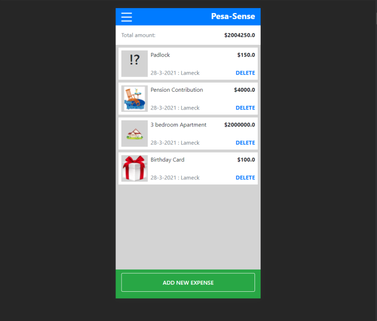

# Pesa-Sense

## Table of Contents

* [About the Project](#about-the-project)
* [Built With](#built-with)
* [Getting Started](#getting-started)
* [Prerequisites](#prerequisites)
* [Contributing](#contributing)
* [Author](#author)
* [Acknowledgements](#acknowledgements)

## About Project

Pesa-Sense is a small Ruby on Rails mobile web application that helps signed-up users keep track of their expenditures. If you are signed up, you will be able to record down where every money spent goes per category or group wise. Therefore, it might help with making financial decisions in the long run that can be helpful. Beside creating groups/categories for you expenditures, there is also an added feature that allows you to budget for every group just to keep you spending further in check.



## [Live Demo](https://pesasense.herokuapp.com/)

## Built With

- Ruby v2.7.2
- Rails 6.1.2
- Postgresql
- Bootstap
- SCSS
- Javascript

## Getting Started

* Clone this repo https://github.com/Lameck1/pesasense
    ```
    git clone https://github.com/Lameck1/pesasense.git
    ```
* Navigate to pesasense folder/directory
    ```
    cd pesasense
    ```
* On the terminal, while in the 'pesasense' directory, run the following to install dependencies:
    ```
    bundle install
    ```
* At this point, you still don't have the PostgreSQL database. Run the following to get setup:

  - Ensure that postgresql service is up and runnning
        ```
        sudo service postgresql start
        ```
  - Create the database
        ```
        rails db:create
        ```

  - Migrate the database
        ```
        rails db:migrate
        ```

  - This is optional, but you can run ```rails db:seed``` to quickly get setup with sample data for testing the app.

* To interact with the project, run:
    ```
    rails server
    ```

    OR

    ```
    rails s
    ```
* Go to the browser and enter 
    ```http://localhost:3000```


### Prerequisites

- Ensure you have these installed:
    - Git
    - Ruby 2.7.2
    - Ruby on rails ```gem install rails```

- You also need to ensure your yarn is upto date
    ```
    yarn install --check-files
    ```

## Contributing

Contributions, issues, and feature requests are welcome!

Feel free to check the [issues page](https://github.com/Lameck1/pesasense/issues).

## Author

👤 **Lameck Otieno**
  - GitHub: [@githubhandle](https://github.com/Lameck1)
  - Twitter: [@twitterhandle](https://twitter.com/lameck721)
  - LinkedIn: [LinkedIn](https://www.linkedin.com/in/lameck-odhiambo-642b7077/)

## Acknowledgements

Credits go to the following for providing guides on Ruby on Rails
  - [**Rails Guides**](https://guides.rubyonrails.org)

Credits also to Microverse for task and project design provision.

## Show your support

Give a ⭐️ if you like this project!